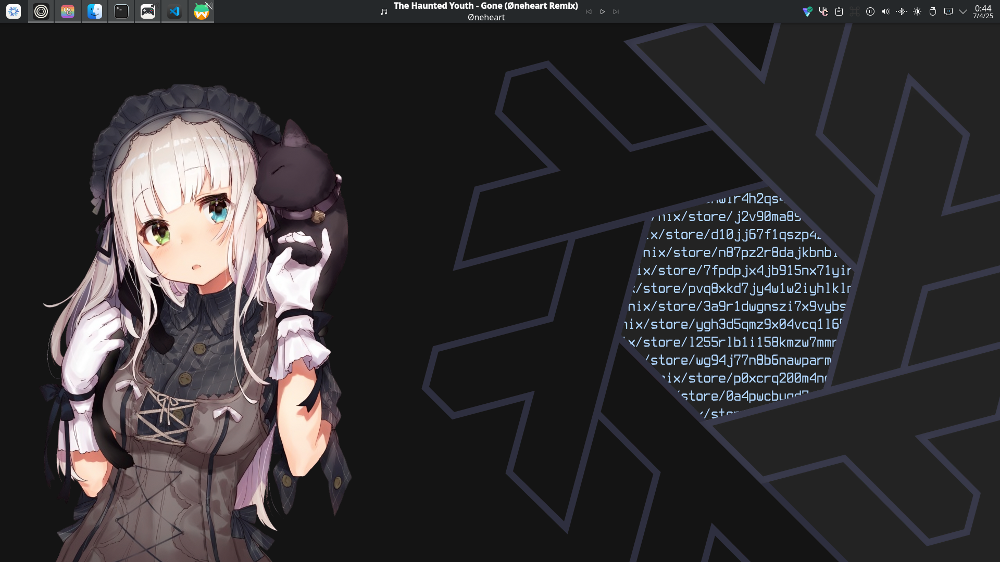
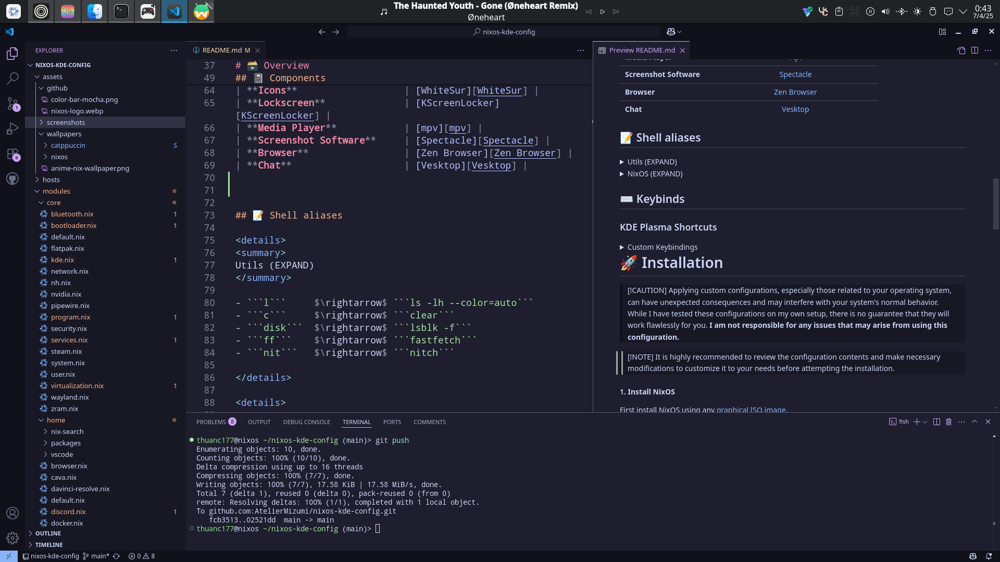
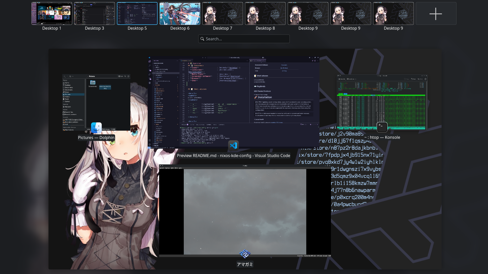

<h1 align="center">
     
    <br>
      My NixOS KDE Flakes 
      <p></p>
    <div align="center">
        <p align="center">
            
        </p>
    </div>
       <div align="center">
        <a href="https://github.com/Zolkyed/nixos-kde-config/">
                    
                 </a>
                 <a href="https://nixos.org">
                    
                 </a>
                 <a href="https://github.com/Zolkyed/nixos-kde-config/blob/main/LICENSE">
                    
                 </a>
       </div>
      <br>
   </div>
</h1>

### 🖼️ Gallery

<p align="center">
    <br>
    <br>
    <br>
   Screenshots last updated <b>2026-04-25</b>
</p>

# 🗃️ Overview

## 📚 Layout

-   [flake.nix](flake.nix) base of the configuration
-   [hosts](hosts) 🌳 per-host configurations that contain machine specific configurations
    - [laptop](hosts/laptop/) 💻 Laptop specific configuration
-   [modules](modules) 🍱 modularized NixOS configurations
    -   [core](modules/core/) ⚙️ Core NixOS configuration
    -   [home](modules/home/) 🏠 my [Home-Manager](https://github.com/nix-community/home-manager) config
-   [assets](assets/) 🌄 wallpapers and assets collection

## 📓 Components
|                             | NixOS + KDE Plasma 6                                                                          |
| --------------------------- | :---------------------------------------------------------------------------------------------:|
| **Desktop Environment**     | [KDE Plasma 6][KDE Plasma 6] |
| **Window Manager**          | [KWin][KWin] |
| **Application Launcher**    | [KDE Kickoff][KDE Kickoff] |
| **Terminal Emulator**       | [Konsole][Konsole] |
| **Shell**                   | [Fish][Fish] |
| **Text Editor**             | [VSCode][VSCode] + [Neovim][Neovim] |
| **Network Management**      | [NetworkManager][NetworkManager] + [Plasma NetworkManager][Plasma NetworkManager] |
| **System Monitor**          | [Mission Center][Mission Center] |
| **File Manager**            | [Dolphin][Dolphin] |
| **Fonts**                   | [Noto Sans][Noto Sans] + [Noto Mono Nerd Font][Noto Mono Nerd Font] |
| **Color Scheme**            | [Breeze Dark][Breeze Dark] |
| **Cursor**                  | [Bibata-Modern-Ice][Bibata-Modern-Ice] |
| **Icons**                   | [WhiteSur][WhiteSur] |
| **Lockscreen**              | [KScreenLocker][KScreenLocker] |
| **Media Player**            | [mpv][mpv] |
| **Screenshot Software**     | [Spectacle][Spectacle] |
| **Browser**                 | [Zen Browser][Zen Browser] |
| **Chat**                    | [Vesktop][Vesktop] |


## 📝 Shell aliases

<details>
<summary>
Utils (EXPAND)
</summary>

- ```l```     $\rightarrow$ ```ls -lh --color=auto```
- ```c```     $\rightarrow$ ```clear```
- ```disk```  $\rightarrow$ ```lsblk -f```
- ```ff```    $\rightarrow$ ```fastfetch```
- ```nit```   $\rightarrow$ ```nitch```

</details>

<details>
<summary>
NixOS (EXPAND)
</summary>

- ```nh os test```     $\rightarrow$ Test NixOS configuration
- ```nh os switch```   $\rightarrow$ Switch to new NixOS configuration
- ```nh clean all```   $\rightarrow$ Clean old generations
- ```nix flake update``` $\rightarrow$ Update flake inputs

</details>

## 🧰 Commands

<details>
<summary>
Flake (EXPAND)
</summary>

- ```nix flake init```    $\rightarrow$ Initialize a new flake
- ```nix flake update```  $\rightarrow$ Update all flake inputs
- ```nix flake show```    $\rightarrow$ Show flake outputs

</details>

<details>
<summary>
NixOS Rebuild (EXPAND)
</summary>

- ```nixos-rebuild build --flake .#host```   $\rightarrow$ Build configuration without activating
- ```nixos-rebuild test --flake .#host```    $\rightarrow$ Test configuration (reverts on reboot)
- ```nixos-rebuild switch --flake .#host```  $\rightarrow$ Build and activate configuration
- ```nixos-rebuild switch --rollback```      $\rightarrow$ Rollback to previous generation

</details>

<details>
<summary>
Hardware Config (EXPAND)
</summary>

Run ```nixos-generate-config``` to generate hardware configuration files:
- ```/etc/nixos/hardware-configuration.nix```  $\rightarrow$ Copy to ```hosts/<hostname>/```
- ```/etc/nixos/configuration.nix```           $\rightarrow$ Ignore (not used in flakes)

</details>

## ⌨️ Keybinds

### KDE Plasma Shortcuts

<details>
<summary>
Custom Keybindings 
</summary>
</br>
##### Terminal
- ```Meta+Alt+K``` Launch Konsole

##### Window Management (Tiling-style)
- ```Meta+H``` Switch Window Left
- ```Meta+J``` Switch Window Down  
- ```Meta+K``` Switch Window Up
- ```Meta+L``` Switch Window Right
- ```Meta+,``` Expose (Show all windows)
- ```Meta+Tab``` Toggle Overview
- ```Meta+W``` Quit Application

##### Virtual Desktops
- ```Meta+1-9``` Switch to Desktop 1-9
- ```Meta+Shift+1-9``` Move Window to Desktop 1-9

##### System
- ```Meta+Ctrl+Alt+L``` Lock Session

</details>

# 🚀 Installation 

> [!CAUTION]
> Applying custom configurations, especially those related to your operating system, can have unexpected consequences and may interfere with your system's normal behavior. While I have tested these configurations on my own setup, there is no guarantee that they will work flawlessly for you.
> **I am not responsible for any issues that may arise from using this configuration.**

> [!NOTE]
> It is highly recommended to review the configuration contents and make necessary modifications to customize it to your needs before attempting the installation.

#### 1. **Install NixOS**

First install NixOS using any [graphical ISO image](https://nixos.org/download.html#nixos-iso). 

#### 2. **Clone the repo**

```bash
nix-shell -p git
git clone https://github.com/Zolkyed/nixos-kde-config.git
cd nixos-kde-config
```

#### 3. **Update hardware configuration**

Copy the generated hardware configuration to each system profile:

**Laptop:**
```bash
sudo cp /etc/nixos/hardware-configuration.nix hosts/laptop/hardware-configuration.nix
```

**Desktop:**
```bash
sudo cp /etc/nixos/hardware-configuration.nix hosts/desktop/hardware-configuration.nix
```

> [!NOTE]
> It is recommended to see my own hardware configurations, I've made some custom changes in there that may benefits yours

#### 4. **Customize the configuration**

Edit the configuration to match your needs:
- Update user information in `modules/core/user.nix`
- Modify git configuration in `modules/home/git.nix`
- Adjust hardware-specific settings as needed

#### 5. **Build and switch**

```bash
sudo nixos-rebuild switch --flake .#laptop
```

#### 6. **Reboot**

After rebooting, you should be greeted by the KDE Plasma desktop environment with all the custom configurations applied.

## 🛠️ Configuration Highlights

### Plasma Manager Configuration
- Custom panel layout with application launcher, task manager, and system tray
- Configured shortcuts for tiling-like window management
- Power management settings optimized for laptops
- Custom window rules for specific applications

### Home Manager Modules
- **Browser**: Zen Browser with custom configuration
- **Terminal**: Konsole with custom settings
- **Development**: VSCode, Neovim, and development tools
- **Multimedia**: Media players and audio tools
- **Gaming**: Steam, emulators, and gaming utilities

### Core System Configuration
- **Boot**: systemd-boot with configuration limit
- **Audio**: PipeWire with ALSA and PulseAudio compatibility  
- **Graphics**: NVIDIA support with proper Wayland configuration
- **Virtualization**: KVM/QEMU support with virt-manager
- **Input**: Fcitx5 for international input methods

# 👥 Credits

This configuration is inspired by and based on the following sources:

- [Frost-Phoenix/nixos-config](https://github.com/Frost-Phoenix/nixos-config) — Primary inspiration for overall structure, organization, and styling
- [Nixos-KDE-config](https://github.com/AtelierMizumi/nixos-kde-config/tree/main) — Base configuration and initial fork
- [linuxmobile/shin](https://github.com/linuxmobile/shin/tree/hjem) — Ideas for Home Manager integration and user environment setup
- [tuxdotrs/nix-config](https://github.com/tuxdotrs/nix-config/tree/main) — System structure patterns and configuration approaches
- [keenanweaver/nix-config](https://github.com/keenanweaver/nix-config/tree/main) — Additional configuration patterns and design ideas

## 🎨 Tools, Themes & Ecosystem

- [nix-community/plasma-manager](https://github.com/nix-community/plasma-manager) — KDE Plasma configuration management for NixOSmanagement
- [NixOS Community](https://nixos.org/): For the amazing NixOS ecosystem
- [Catppuccin Mocha color theme](https://catppuccin.com/palette/): A dark theme with high contrast, used in my VSCode configuration
- [Catppuccin Wallpapers submodule](https://github.com/zhichaoh/catppuccin-wallpaper): Collection of Catppuccin themed wallpapers.

<p align="center"></p>

<!-- Links -->
[KDE Plasma 6]: https://kde.org/plasma-desktop/
[KWin]: https://userbase.kde.org/KWin
[KDE Kickoff]: https://userbase.kde.org/Plasma/Kickoff
[Konsole]: https://konsole.kde.org/
[Fish]: https://fishshell.com/
[VSCode]: https://code.visualstudio.com/
[Neovim]: https://neovim.io/
[NetworkManager]: https://wiki.gnome.org/Projects/NetworkManager
[Plasma NetworkManager]: https://userbase.kde.org/Plasma/NetworkManager
[Mission Center]: https://gitlab.com/mission-center-devs/mission-center
[Dolphin]: https://apps.kde.org/dolphin/
[Noto Sans]: https://fonts.google.com/noto/specimen/Noto+Sans
[Noto Mono Nerd Font]: https://www.nerdfonts.com/
[Breeze Dark]: https://kde.org/announcements/plasma/5/5.0.0/
[Bibata-Modern-Ice]: https://www.gnome-look.org/p/1197198
[WhiteSur]: https://www.gnome-look.org/p/1403328
[KScreenLocker]: https://userbase.kde.org/KScreenLocker
[mpv]: https://mpv.io/
[Spectacle]: https://apps.kde.org/spectacle/
[Vesktop]: https://github.com/Vencord/Vesktop